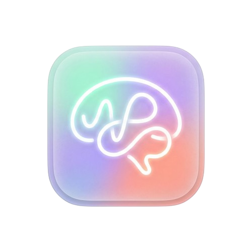

<p align="center">
	
</p>

<h1 align="center">Recall</h1>

<p align="center">
	Turn your notes, PDFs, and lecture materials into AI-generated quizzes, chat, and study workspaces with citations and adaptive learning.
</p>

## Overview

Recall is a Next.js study hub that helps students transform course materials into active recall practice. The app combines document upload, subject-based study spaces, AI chat, and quiz generation backed by Supabase and Azure OpenAI.

## Features

- Home dashboard for managing subjects and course cards
- Study workspace with tabs for chat, quizzes, and documents
- AI-generated quizzes with answer explanations
- Chat experience scoped to a subject

## Tech Stack

- Next.js 16 App Router
- React 19
- TypeScript
- Supabase for data and storage
- Azure OpenAI for chat and quiz generation
- Tailwind CSS 4 and shadcn/ui primitives

## Getting Started

### Prerequisites

- Node.js 18+
- A Supabase project
- Azure OpenAI credentials for the AI routes

### Install

```bash
npm install
```

### Environment Variables

Create a `.env.local` file in the project root with the following values:

```bash
NEXT_PUBLIC_SUPABASE_URL=
NEXT_PUBLIC_SUPABASE_ANON_KEY=
AZURE_OPENAI_ENDPOINT=
AZURE_OPENAI_API_KEY=
```

### Run Locally

```bash
npm run dev
```

Then open [http://localhost:3000](http://localhost:3000).

## Available Scripts

```bash
npm run dev
npm run build
npm run start
npm run lint
```

## Key Routes

- `/` - marketing landing page
- `/home` - subject dashboard
- `/study/[subject]` - subject workspace with chat, quiz, and documents tabs
- `/chat?subject=...` - subject chat interface
- `/quiz?subject=...` - quiz view
- `/settings` - settings placeholder

## Project Structure

- `app/api/chat` - AI chat endpoint
- `app/api/quiz` - quiz generation endpoint
- `app/components` - shared UI, layout, and workspace components
- `lib/supabase.ts` - Supabase client configuration

## Notes

- The app uses `logo-with-bg.png` as the primary brand mark.
- Subject and document data come from Supabase, so the app will only work correctly when the database tables, storage, and policies are configured.
